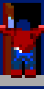
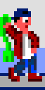

# Manual

## History

1994

En las paredes de tu habitación se mezclan lost posters de Sabrina y Arnold Schwarzenegger. Guns n' Roses suena en la radio. Se está haciendo tarde y mañana tienes los exámenes finales pero en lugar de estudiar te has pasado toda la tarde jugando al Wolfenstein 3D. "mein leben" no para de sonar en tu cabeza... que cojones significa eso? Ahora te toca ponerte a estudiar pero, por supuesto, las mates son una mierda y te quedas frito. Bienvenido a Pesadilla del '94.

1994

In your room there's a mix of Sabrina and Arnold Schwarzenegger posters hanging from the walls. Guns n' Roses is playing on the radio. It's getting late and tomorrow you have the finals but instead of studying you have been playing Wolfenstein 3D the whole afternoon. "mein leben" resonates in your head constantly... what the heck that means? Now it's time to get into work but, of course, maths sucks and you fall alseep. Welcome to Nightare of '94.

## Game instructions

Ayuda a Federico a econtrar las respuestas de todos los exámenes buscando en cada una de las aulas. Abre las puertas puertas para encontrarlas todas. Evita los joysticks que intentan distraerte de tu objetivo. Usa las escaleras para esquivar a los enemigos y moverte entre las distintas plantas. Consigue la "mano loca" dentro de las bolsas de patatas chips que hay en las máquinas de vending y úsala para aturdir a los enemigos.

Help Federico to find all exam answers by searching inside the classrooms. Open the doors to find them all. Avoid the joysticks that wants to distract you from your goal. Use the stairs to dodge enemies and move between floors. Get the "sticky hand" inside the potato chips from the vending machines and use it to stunt the enemies.

## Controls

### Move the player:

Usa las teclas de dirección para mover al player por el mapa.

Use arrow keys to move player around the map.

### Search doors:

Mantén la tecla arriba delante de una puerta para buscar dentro del aula.

Hold up arrow key in front of a door to search inside the classroom.

 &nbsp;&nbsp;&nbsp; 

### Move between floors:

Pulsa las teclas arriba o abajo para moverte entre las distintas plantas.

Use up or down arrow keys to move between floors using the stairs.

### Use weapon:

Pulsa espacio para dar un latigazo a los enemigos cuando tienes la "mano loca" y está activada. La "mano loca" necesita un tiempo para volver a estar activa después de ser usada. Estate atento a cuando se ilumine el indicador de "mano loca" en el marcador para saber cuando puede usarlo de nuevo.

Use space key to whip the enemies when you have the "sticky hand" equipped and it is ready to be used. The "sticky hand" needs some time to be available again after being used. Look for the HUD "sticky hand" indicator to be lighted up to know you can use the whip again.

Para conseguir la "mano loca" primero tienes que cogerla de dentro de las bolsas de patatas que encontrarás en las máquinas de vending pulsando la tecla arriba just delante de ellas.

To get the "sticky hand" you must first get it from the potato chips bags inside the vending machines by holding up arrow key in front of it.

